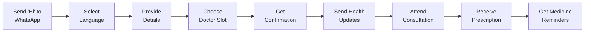
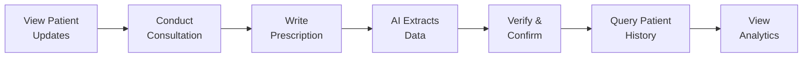

# 🏥 Healthcare Workflow Automation System

> **Transforming Healthcare Delivery in India Through AI-Powered Paperless Workflows**

[](https://aiforbharat.com)
[](https://kiro.dev)
[](LICENSE)

---

## 🎯 Problem Statement

In India's healthcare system, **paper-based workflows create critical inefficiencies**:
- ⏰ Hours wasted on manual data entry
- 📝 Errors from illegible handwriting
- 📄 Lost or misplaced patient forms
- 🔍 Inaccessible patient history during consultations
- 🗣️ Language barriers for non-English speaking patients

**Our solution**: A comprehensive AI-powered system that digitizes the entire hospitalization process, from appointment booking to prescription delivery, making healthcare more efficient, accurate, and accessible.

---

## 💡 Solution Overview

### **End-to-End Paperless Healthcare Workflow**

```
Whatsapp Chatbot for Appointment Booking → Pre-Consultation Updates → Digital Prescription → Medicine Reminders → Analytics Dashboard for Hospital
```

Our system eliminates paper at every touchpoint while leveraging AI to handle the complexity of multilingual communication, handwriting recognition, and intelligent data extraction.

---

## ✨ Key Features

### 1. 📱 **WhatsApp-Based Appointment Booking**
- **Multilingual Support**
- **Conversational Interface**: Natural language booking flow
- **Automated Reminders**: 24-hour and 1-hour appointment notifications


### 2. 🎤 **Pre-Consultation Patient Updates**
- **Text & Audio Support**: Patients can send health updates via text or voice messages before the consultation on whatsapp
- **Automatic Transcription**: AI converts audio to text
- **Medical Entity Extraction**: AI identifies symptoms, conditions, and relevant medical information
- **Structured Storage**: Updates are tagged and stored for doctor review during consultation

### 3. ✍️ **Digital Prescription System**
- **iPad Handwriting Capture**: Doctors write naturally on tablets
- **OCR Extraction**: AI reads Doctor's handwritten prescriptions with high accuracy
- **Structured Data**: Automatically extracts medicines, dosages, diagnosis, and notes
- **PDF Generation**: Creates professional prescription documents
- **WhatsApp Delivery**: Sends prescriptions directly to patients

### 4. 💊 **Post-Consultation Engagement**
- **Review Collection**: Automated feedback requests
- **Medicine Reminders**: Smart scheduling based on prescription frequency (medicine and its course will be extracted from the doctors handwritten prescription, will be stored in the database and then will be used for sending reminders)
- **Adherence Support**: Reminders throughout medication course

### 5. 🤖 **AI-Powered Doctor Dashboard**
(The entire patient database is structured into a graph database to enable relationship-aware querying and power the conversational analytics chatbot.)
- **Conversational Queries**: "When did patient XYZ last visit?"
- **Patient History**: Complete medical history at your fingertips
- **Hospital Analytics**: Patient volume, doctor performance, treatment patterns
- **Graph Database**: Semantic search for similar cases and patterns

---

## 🏗️ Architecture

### **Microservices-Based Design**

```
┌─────────────────────────────────────────────────────────────┐
│                     Client Layer                             │
│  ┌──────────────────┐         ┌──────────────────┐         │
│  │  WhatsApp Client │         │ Doctor Dashboard │         │
│  └──────────────────┘         └──────────────────┘         │
└─────────────────────────────────────────────────────────────┘
                            │
┌─────────────────────────────────────────────────────────────┐
│                   API Gateway Layer                          │
└─────────────────────────────────────────────────────────────┘
                            │
┌─────────────────────────────────────────────────────────────┐
│                 Application Services                         │
│  ┌──────────┐  ┌──────────┐  ┌──────────┐  ┌──────────┐   │
│  │WhatsApp  │  │Appointment│  │Prescription│ │Analytics │   │
│  │Bot Service│ │  Service  │  │  Service  │  │ Service  │   │
│  └──────────┘  └──────────┘  └──────────┘  └──────────┘   │
└─────────────────────────────────────────────────────────────┘
                            │
┌─────────────────────────────────────────────────────────────┐
│                    AI/ML Services                            │
│  ┌──────────┐  ┌──────────┐  ┌──────────┐  ┌──────────┐   │
│  │   OCR    │  │   NLP    │  │Transcription│ │   LLM   │   │
│  │ Service  │  │Extraction│  │  Service   │  │  Query  │   │
│  └──────────┘  └──────────┘  └──────────┘  └──────────┘   │
└─────────────────────────────────────────────────────────────┘
                            │
┌─────────────────────────────────────────────────────────────┐
│                      Data Layer                              │
│  ┌──────────┐  ┌──────────┐                                │
│  │ Database │  │  Neo4j   │                                │
│  │          │  │ (Graph)  │                                │
│  └──────────┘  └──────────┘                                │
└─────────────────────────────────────────────────────────────┘

```

### **Technology Stack**

| Layer | Technology |
|-------|-----------|
| **Backend** | Python 3.11+, FastAPI |
| **Databases** | MySQL (transactional), Neo4j (graph) |
| **AI/ML** | PaddleOCR, spaCy NER, Hugging Face, LangChain + GPT-4 |
| **Integration** | WhatsApp Business API (Meta) |
| **Frontend** | React 18+ with TypeScript, Material-UI |

---

## 🎨 User Journey

### **Patient Experience**



### **Doctor Experience**


---

## 📊 Why AI is Essential

This system demonstrates **meaningful AI usage** in healthcare automation:

### 1. **Handwriting Recognition (OCR)**
Traditional OCR fails with doctor handwriting. We use **deep learning models** trained on medical handwriting datasets to achieve high accuracy with variable handwriting styles and medical abbreviations.

### 2. **Natural Language Understanding (NLP)**
Patients describe symptoms in conversational language across multiple languages. **AI-powered NLP** extracts structured medical entities (symptoms, conditions, medications) from unstructured text—impossible with rule-based systems.

### 3. **Speech Recognition & Transcription**
Converting multilingual audio with medical terminology, Indian accents, and background noise requires **sophisticated speech recognition models** like OpenAI Whisper.

### 4. **Conversational Database Queries**
**LLMs enable semantic understanding** of natural language queries and translate them to database queries. Doctors can ask "When did patient XYZ last visit?" instead of writing SQL.

### 5. **Graph-Based Semantic Search**
**Graph databases + LLMs** enable queries like "find patients with similar symptoms" that go beyond keyword matching, understanding medical relationships and patterns.

---
---

## 🎯 Hackathon Submission

**AI for Bharat Hackathon - Professional Track**

**Category**: AI for Healthcare & Life Sciences

**Focus**: Workflow automation for healthcare professionals

### **Submission Checklist**
- ✅ requirements.md - Comprehensive requirements specification
- ✅ design.md - System architecture and design document
- ✅ README.md - Project overview and documentation

---

## 👥 Team

### 🏷️ Team Name: ByteBit  

Developed for the **AI for Bharat Hackathon 2025**

### 👨‍💻 Team Members

- **Avi Gupta**  
  - GitHub: https://github.com/IVAVI17  
  - LinkedIn: https://www.linkedin.com/in/avi-gupta17/ 

- **Kartikey Bhatnagar**  
  - GitHub: https://github.com/kartikey-codes
  - LinkedIn: https://www.linkedin.com/in/kartikey-bhatnagar/

---

<div align="center">

**Built with ❤️ for better healthcare in India**

[View Requirements](requirements.md) | [View Design](design.md) | [View Tasks](tasks.md)

</div>
