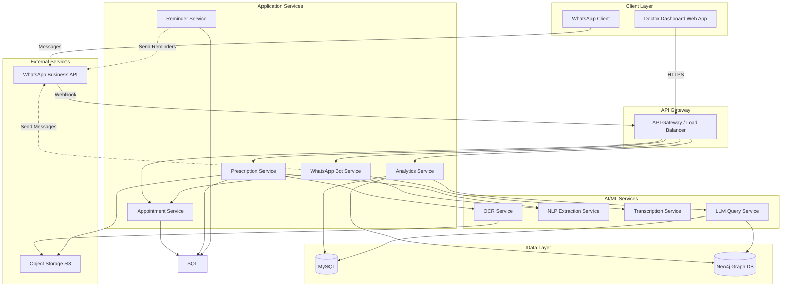

# Design Document: Healthcare Workflow Automation System

## Overview

The Healthcare Workflow Automation System is a microservices-based platform that digitizes hospital workflows through WhatsApp-based patient interaction, AI-powered data extraction, and intelligent analytics. The system architecture prioritizes modularity, scalability, and data privacy while integrating multiple AI services for natural language processing, handwriting recognition, and conversational querying.

The design follows a layered architecture:
- **Presentation Layer**: WhatsApp Bot interface and Doctor Dashboard web application
- **Application Layer**: Business logic services for appointments, prescriptions, reminders, and analytics
- **AI/ML Layer**: Specialized services for OCR, NLP, transcription, and LLM-powered querying
- **Data Layer**: MySQL for transactional data, Neo4j for graph-based patient relationships
- **Integration Layer**: WhatsApp Business API, notification services, and external AI providers

## Architecture

### High-Level Architecture

### Technology Stack

**Backend Services:**
- Language: Python 3.11+ (FastAPI for services)

**AI/ML Stack:**
- OCR: TrOCR (Microsoft) or PaddleOCR for handwriting recognition
- NLP: spaCy with custom medical entity recognition models
- LLM: LangChain + Hugging face

**Databases:**
- Transactional: MySQL
- Graph: Neo4j 5+ for patient relationship modeling

**Frontend:**
- Doctor Dashboard: React 18+ with TypeScript
- UI Framework: Material-UI 

**WhatsApp Integration:**
- WhatsApp Business API (Cloud API or On-Premises)
- Webhook handling with signature verification
- Message templates for notifications

## Future Enhancements

**Phase 2 Features:**
1. **Lab Report Integration**: Upload and parse lab reports, link to patient history
2. **Insurance Integration**: Automatic insurance claim filing and tracking
3. **Wearable Device Integration**: Import health data from fitness trackers and smartwatches

**AI Improvements:**
1. **Symptom Checker**: AI-powered preliminary symptom assessment

**User Experience:**
1. **Voice-Based Booking**: Complete appointment booking via voice commands
2. **Health Timeline**: Visual timeline of patient's health journey

## Conclusion

This design provides a comprehensive, scalable, and secure foundation for the Healthcare Workflow Automation System. The microservices architecture enables independent scaling and deployment of components, while the dual-database approach (PostgreSQL + Neo4j) supports both transactional operations and complex relationship queries.

The AI/ML integration is meaningful and essential: handwriting recognition, natural language processing, and conversational querying provide capabilities that rule-based systems cannot achieve. The system prioritizes data privacy, transparency, and accuracy through comprehensive error handling, audit logging, and confidence scoring.

The testing strategy combines unit tests for specific scenarios with property-based tests for universal correctness, ensuring robust validation across all possible inputs. The deployment architecture supports high availability, disaster recovery, and horizontal scaling to meet growing demand.
