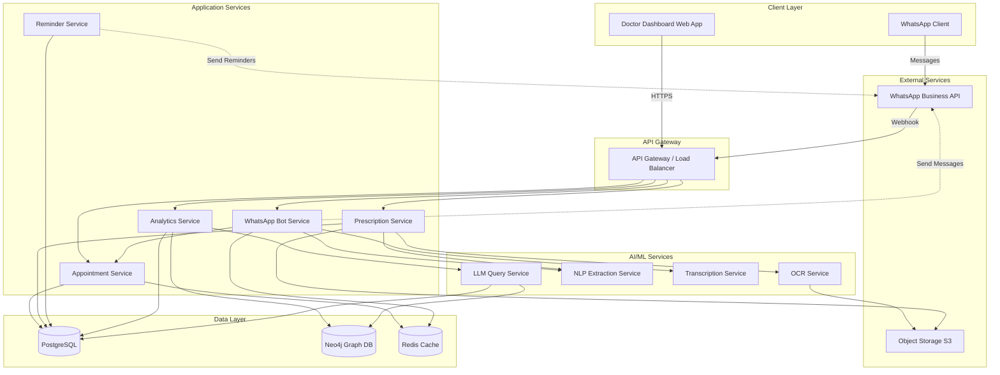
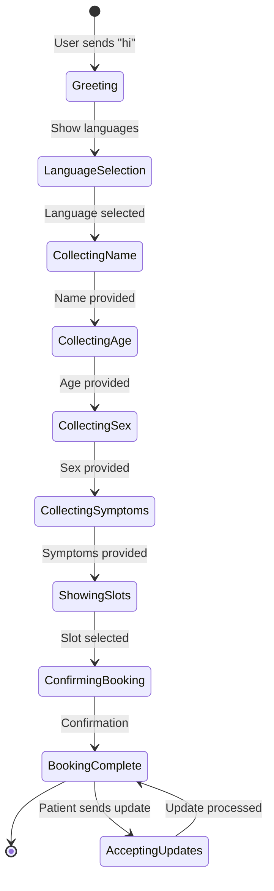
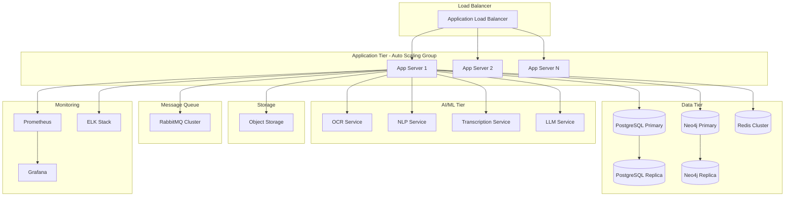

# Design Document: Healthcare Workflow Automation System

## Overview

The Healthcare Workflow Automation System is a microservices-based platform that digitizes hospital workflows through WhatsApp-based patient interaction, AI-powered data extraction, and intelligent analytics. The system architecture prioritizes modularity, scalability, and data privacy while integrating multiple AI services for natural language processing, handwriting recognition, and conversational querying.

The design follows a layered architecture:
- **Presentation Layer**: WhatsApp Bot interface and Doctor Dashboard web application
- **Application Layer**: Business logic services for appointments, prescriptions, reminders, and analytics
- **AI/ML Layer**: Specialized services for OCR, NLP, transcription, and LLM-powered querying
- **Data Layer**: PostgreSQL for transactional data, Neo4j for graph-based patient relationships
- **Integration Layer**: WhatsApp Business API, notification services, and external AI providers

## Architecture

### High-Level Architecture



### Technology Stack

**Backend Services:**
- Language: Python 3.11+ (FastAPI for services)
- API Gateway: Kong or AWS API Gateway
- Message Queue: RabbitMQ or AWS SQS for async processing
- Caching: Redis for session management and rate limiting

**AI/ML Stack:**
- OCR: TrOCR (Microsoft) or PaddleOCR for handwriting recognition
- NLP: spaCy with custom medical entity recognition models
- Transcription: OpenAI Whisper or Google Speech-to-Text API
- LLM: LangChain + GPT-4 or Claude for conversational queries
- Vector DB: Pinecone or Weaviate for semantic search (optional enhancement)

**Databases:**
- Transactional: PostgreSQL 15+ with TimescaleDB extension for time-series data
- Graph: Neo4j 5+ for patient relationship modeling
- Cache: Redis 7+ for session state and rate limiting

**Frontend:**
- Doctor Dashboard: React 18+ with TypeScript
- UI Framework: Material-UI or Ant Design
- State Management: Redux Toolkit or Zustand
- Charts: Recharts or Apache ECharts

**Infrastructure:**
- Containerization: Docker
- Orchestration: Kubernetes or AWS ECS
- Object Storage: AWS S3 or MinIO
- Monitoring: Prometheus + Grafana
- Logging: ELK Stack (Elasticsearch, Logstash, Kibana)

**WhatsApp Integration:**
- WhatsApp Business API (Cloud API or On-Premises)
- Webhook handling with signature verification
- Message templates for notifications

## Components and Interfaces

### 1. WhatsApp Bot Service

**Responsibilities:**
- Handle incoming WhatsApp messages via webhook
- Manage conversation state and context
- Route messages to appropriate business logic services
- Send outbound messages via WhatsApp Business API
- Support multilingual conversations

**Key Interfaces:**

```python
class WhatsAppBotService:
    def handle_webhook(webhook_data: WebhookPayload) -> Response:
        """
        Process incoming WhatsApp webhook events.
        Validates signature, extracts message, routes to handler.
        """
        pass
    
    def process_message(message: IncomingMessage, context: ConversationContext) -> BotResponse:
        """
        Main message processing logic.
        Determines intent, maintains state, generates response.
        """
        pass
    
    def send_message(phone_number: str, message: OutboundMessage, language: str) -> SendResult:
        """
        Send message via WhatsApp Business API.
        Handles templated messages and free-form text.
        """
        pass
    
    def get_conversation_context(phone_number: str) -> ConversationContext:
        """
        Retrieve conversation state from Redis cache.
        Includes: current step, collected data, language preference.
        """
        pass
    
    def update_conversation_context(phone_number: str, context: ConversationContext) -> None:
        """
        Update conversation state in Redis cache.
        """
        pass
```

**Data Models:**

```python
class IncomingMessage:
    message_id: str
    from_phone: str
    timestamp: datetime
    message_type: MessageType  # TEXT, AUDIO, IMAGE
    content: str | bytes
    language_code: Optional[str]

class ConversationContext:
    phone_number: str
    current_state: ConversationState  # GREETING, COLLECTING_INFO, BOOKING, etc.
    language: str
    collected_data: Dict[str, Any]
    patient_id: Optional[int]
    appointment_id: Optional[int]
    last_interaction: datetime

class OutboundMessage:
    message_type: MessageType
    content: str
    template_name: Optional[str]
    template_params: Optional[Dict[str, str]]
    media_url: Optional[str]
```

**Conversation Flow State Machine:**



### 2. Appointment Service

**Responsibilities:**
- Manage appointment lifecycle (create, update, cancel)
- Check doctor availability and slot management
- Store appointment data in PostgreSQL
- Trigger reminder scheduling

**Key Interfaces:**

```python
class AppointmentService:
    def create_appointment(appointment_data: AppointmentCreate) -> Appointment:
        """
        Create new appointment record.
        Validates slot availability, stores in database.
        """
        pass
    
    def get_available_slots(symptoms: List[str], date: date) -> List[DoctorSlot]:
        """
        Query available doctor slots based on symptoms.
        Matches symptoms to doctor specializations.
        """
        pass
    
    def get_patient_appointments(patient_id: int) -> List[Appointment]:
        """
        Retrieve all appointments for a patient.
        """
        pass
    
    def update_appointment_status(appointment_id: int, status: AppointmentStatus) -> Appointment:
        """
        Update appointment status (SCHEDULED, COMPLETED, CANCELLED).
        """
        pass
    
    def get_upcoming_appointments(time_window: timedelta) -> List[Appointment]:
        """
        Get appointments within specified time window for reminder service.
        """
        pass
```

**Data Models:**

```python
class Appointment:
    id: int
    patient_id: int
    doctor_id: int
    scheduled_time: datetime
    status: AppointmentStatus
    symptoms: List[str]
    created_at: datetime
    updated_at: datetime

class AppointmentCreate:
    patient_id: int
    doctor_id: int
    scheduled_time: datetime
    symptoms: List[str]

class DoctorSlot:
    doctor_id: int
    doctor_name: str
    specialization: str
    available_times: List[datetime]
    consultation_duration: timedelta
```

### 3. Prescription Service

**Responsibilities:**
- Capture handwritten prescriptions from iPad interface
- Coordinate OCR and NLP extraction
- Generate structured prescription data
- Create PDF documents
- Send prescriptions via WhatsApp

**Key Interfaces:**

```python
class PrescriptionService:
    def capture_prescription_image(doctor_id: int, appointment_id: int, image: bytes) -> PrescriptionDraft:
        """
        Store prescription image in object storage.
        Initiate OCR processing asynchronously.
        """
        pass
    
    def process_prescription_ocr(prescription_id: int) -> OCRResult:
        """
        Extract text from prescription image using OCR service.
        Returns raw text and confidence scores.
        """
        pass
    
    def extract_prescription_entities(ocr_text: str) -> PrescriptionEntities:
        """
        Use NLP service to extract structured data from OCR text.
        Identifies: medicines, dosages, diagnosis, notes.
        """
        pass
    
    def confirm_prescription(prescription_id: int, verified_data: PrescriptionData) -> Prescription:
        """
        Doctor confirms/corrects extracted data.
        Stores final prescription in database.
        """
        pass
    
    def generate_prescription_pdf(prescription_id: int, language: str) -> bytes:
        """
        Generate formatted PDF prescription document.
        """
        pass
    
    def send_prescription_to_patient(prescription_id: int) -> SendResult:
        """
        Send PDF prescription via WhatsApp to patient.
        """
        pass
```

**Data Models:**

```python
class PrescriptionDraft:
    id: int
    appointment_id: int
    doctor_id: int
    image_url: str
    status: PrescriptionStatus  # DRAFT, PROCESSING, VERIFIED, SENT
    created_at: datetime

class OCRResult:
    prescription_id: int
    raw_text: str
    confidence_score: float
    processing_time: float

class PrescriptionEntities:
    medicines: List[Medicine]
    diagnosis: str
    medical_notes: str
    confidence_scores: Dict[str, float]

class Medicine:
    name: str
    dosage: str
    frequency: str
    duration: str
    instructions: str

class Prescription:
    id: int
    appointment_id: int
    patient_id: int
    doctor_id: int
    diagnosis: str
    medicines: List[Medicine]
    medical_notes: str
    pdf_url: str
    created_at: datetime
```

### 4. OCR Service

**Responsibilities:**
- Extract text from handwritten prescription images
- Provide confidence scores for extracted text
- Handle medical terminology and abbreviations
- Support multiple handwriting styles

**Key Interfaces:**

```python
class OCRService:
    def extract_text_from_image(image: bytes, language: str = "en") -> OCRResult:
        """
        Process image and extract text using TrOCR or PaddleOCR.
        Returns text with confidence scores.
        """
        pass
    
    def preprocess_image(image: bytes) -> bytes:
        """
        Enhance image quality: deskew, denoise, normalize contrast.
        """
        pass
    
    def post_process_text(raw_text: str) -> str:
        """
        Clean OCR output: fix common errors, expand abbreviations.
        """
        pass
```

**Implementation Notes:**
- Use TrOCR (Transformer-based OCR) fine-tuned on medical handwriting dataset
- Preprocessing pipeline: grayscale conversion, adaptive thresholding, deskewing
- Post-processing: medical abbreviation expansion dictionary, spell checking
- Confidence threshold: flag extractions below 0.7 confidence for manual review

### 5. NLP Extraction Service

**Responsibilities:**
- Extract medical entities from unstructured text
- Identify medicines, dosages, diagnoses, symptoms
- Support multilingual entity recognition
- Provide confidence scores for extractions

**Key Interfaces:**

```python
class NLPExtractionService:
    def extract_medical_entities(text: str, language: str) -> MedicalEntities:
        """
        Extract structured medical information from text.
        Uses spaCy with custom medical NER model.
        """
        pass
    
    def extract_medicines(text: str) -> List[Medicine]:
        """
        Identify medicine names, dosages, frequencies, durations.
        """
        pass
    
    def extract_diagnosis(text: str) -> str:
        """
        Identify diagnosis or medical condition mentioned.
        """
        pass
    
    def extract_symptoms(text: str) -> List[str]:
        """
        Extract symptom mentions from patient updates.
        """
        pass
```

**Data Models:**

```python
class MedicalEntities:
    medicines: List[Medicine]
    diagnosis: Optional[str]
    symptoms: List[str]
    confidence_scores: Dict[str, float]

class EntityExtraction:
    entity_type: str  # MEDICINE, DIAGNOSIS, SYMPTOM, DOSAGE
    text: str
    start_pos: int
    end_pos: int
    confidence: float
```

**Implementation Notes:**
- Base model: spaCy with custom medical NER trained on synthetic medical text
- Entity types: MEDICINE, DOSAGE, FREQUENCY, DURATION, DIAGNOSIS, SYMPTOM
- Use medical ontologies (SNOMED CT, RxNorm) for entity normalization
- Multilingual support: separate models for each supported language

### 6. Transcription Service

**Responsibilities:**
- Convert audio messages to text
- Detect spoken language automatically
- Handle medical terminology in speech
- Support Indian accents and dialects

**Key Interfaces:**

```python
class TranscriptionService:
    def transcribe_audio(audio: bytes, hint_language: Optional[str] = None) -> TranscriptionResult:
        """
        Transcribe audio to text using Whisper or Google Speech-to-Text.
        Auto-detects language if not provided.
        """
        pass
    
    def detect_language(audio: bytes) -> str:
        """
        Detect spoken language from audio.
        """
        pass
```

**Data Models:**

```python
class TranscriptionResult:
    text: str
    language: str
    confidence: float
    duration: float
```

**Implementation Notes:**
- Use OpenAI Whisper (large-v3 model) for high accuracy with medical terms
- Fallback to Google Speech-to-Text API for real-time transcription
- Language detection: Whisper's built-in language detection
- Post-processing: medical term correction using custom dictionary

### 7. Reminder Service

**Responsibilities:**
- Schedule appointment reminders (24h and 1h before)
- Schedule medication reminders based on prescription
- Send reminders via WhatsApp
- Handle reminder acknowledgments

**Key Interfaces:**

```python
class ReminderService:
    def schedule_appointment_reminders(appointment: Appointment) -> List[Reminder]:
        """
        Create reminder records for 24h and 1h before appointment.
        """
        pass
    
    def schedule_medication_reminders(prescription: Prescription) -> List[Reminder]:
        """
        Calculate reminder schedule based on medication frequency.
        Create reminder records for entire course duration.
        """
        pass
    
    def process_due_reminders() -> None:
        """
        Background job: check for due reminders and send them.
        Runs every minute.
        """
        pass
    
    def send_reminder(reminder: Reminder) -> SendResult:
        """
        Send reminder message via WhatsApp.
        """
        pass
    
    def cancel_reminders(appointment_id: int) -> None:
        """
        Cancel all reminders for an appointment (e.g., if cancelled).
        """
        pass
```

**Data Models:**

```python
class Reminder:
    id: int
    reminder_type: ReminderType  # APPOINTMENT, MEDICATION
    patient_id: int
    appointment_id: Optional[int]
    prescription_id: Optional[int]
    scheduled_time: datetime
    message_template: str
    status: ReminderStatus  # PENDING, SENT, FAILED, CANCELLED
    sent_at: Optional[datetime]

class ReminderType(Enum):
    APPOINTMENT_24H = "appointment_24h"
    APPOINTMENT_1H = "appointment_1h"
    MEDICATION = "medication"
```

**Implementation Notes:**
- Use cron job or scheduled task (every minute) to check for due reminders
- Store reminders in PostgreSQL with indexed scheduled_time column
- Medication reminder calculation: parse frequency (e.g., "3 times daily") into specific times
- Retry failed reminders up to 3 times with exponential backoff

### 8. Analytics Service

**Responsibilities:**
- Provide conversational query interface for doctors
- Generate hospital-wide analytics
- Query patient history from graph database
- Integrate LLM for natural language to database query translation

**Key Interfaces:**

```python
class AnalyticsService:
    def query_patient_history(doctor_id: int, query: str) -> QueryResult:
        """
        Process natural language query about patient history.
        Uses LLM to generate Cypher query for Neo4j.
        """
        pass
    
    def query_doctor_statistics(doctor_id: int, query: str) -> QueryResult:
        """
        Process natural language query about doctor's own statistics.
        """
        pass
    
    def query_hospital_analytics(admin_id: int, query: str) -> QueryResult:
        """
        Process natural language query about hospital-wide metrics.
        Requires admin authorization.
        """
        pass
    
    def generate_patient_report(patient_id: int, doctor_id: int) -> PatientReport:
        """
        Generate comprehensive patient history report.
        """
        pass
```

**Data Models:**

```python
class QueryResult:
    query: str
    result_type: ResultType  # TABLE, CHART, TEXT
    data: Any
    confidence: float
    sources: List[str]
    generated_sql: Optional[str]

class PatientReport:
    patient_id: int
    patient_name: str
    total_visits: int
    visit_history: List[VisitSummary]
    diagnoses: List[str]
    prescriptions: List[PrescriptionSummary]
    generated_at: datetime
```

### 9. LLM Query Service

**Responsibilities:**
- Translate natural language queries to database queries
- Generate Cypher queries for Neo4j
- Generate SQL queries for PostgreSQL
- Provide conversational responses with citations

**Key Interfaces:**

```python
class LLMQueryService:
    def natural_language_to_cypher(query: str, context: QueryContext) -> CypherQuery:
        """
        Convert natural language to Neo4j Cypher query.
        Uses LangChain with GPT-4 and graph schema context.
        """
        pass
    
    def natural_language_to_sql(query: str, context: QueryContext) -> SQLQuery:
        """
        Convert natural language to PostgreSQL query.
        Uses LangChain with database schema context.
        """
        pass
    
    def generate_response(query_results: Any, original_query: str) -> str:
        """
        Generate natural language response from query results.
        """
        pass
```

**Data Models:**

```python
class QueryContext:
    user_id: int
    user_role: UserRole
    allowed_tables: List[str]
    schema_context: str

class CypherQuery:
    cypher: str
    parameters: Dict[str, Any]
    confidence: float

class SQLQuery:
    sql: str
    parameters: Dict[str, Any]
    confidence: float
```

**Implementation Notes:**
- Use LangChain with GPT-4 or Claude for query generation
- Provide database schema as context in system prompt
- Implement query validation to prevent unauthorized data access
- Use few-shot examples for common query patterns
- Cache common queries in Redis for performance

## Data Models

### PostgreSQL Schema

```sql
-- Patients table
CREATE TABLE patients (
    id SERIAL PRIMARY KEY,
    phone_number VARCHAR(20) UNIQUE NOT NULL,
    name VARCHAR(255) NOT NULL,
    age INTEGER NOT NULL,
    sex VARCHAR(10) NOT NULL,
    language_preference VARCHAR(10) DEFAULT 'en',
    created_at TIMESTAMP DEFAULT CURRENT_TIMESTAMP,
    updated_at TIMESTAMP DEFAULT CURRENT_TIMESTAMP
);

-- Doctors table
CREATE TABLE doctors (
    id SERIAL PRIMARY KEY,
    name VARCHAR(255) NOT NULL,
    specialization VARCHAR(255) NOT NULL,
    phone_number VARCHAR(20),
    email VARCHAR(255),
    created_at TIMESTAMP DEFAULT CURRENT_TIMESTAMP
);

-- Appointments table
CREATE TABLE appointments (
    id SERIAL PRIMARY KEY,
    patient_id INTEGER REFERENCES patients(id),
    doctor_id INTEGER REFERENCES doctors(id),
    scheduled_time TIMESTAMP NOT NULL,
    status VARCHAR(20) NOT NULL, -- SCHEDULED, COMPLETED, CANCELLED
    symptoms TEXT[],
    created_at TIMESTAMP DEFAULT CURRENT_TIMESTAMP,
    updated_at TIMESTAMP DEFAULT CURRENT_TIMESTAMP,
    INDEX idx_scheduled_time (scheduled_time),
    INDEX idx_patient_id (patient_id),
    INDEX idx_doctor_id (doctor_id)
);

-- Patient updates table
CREATE TABLE patient_updates (
    id SERIAL PRIMARY KEY,
    patient_id INTEGER REFERENCES patients(id),
    appointment_id INTEGER REFERENCES appointments(id),
    content TEXT NOT NULL,
    update_type VARCHAR(20) NOT NULL, -- TEXT, AUDIO_TRANSCRIBED
    extracted_entities JSONB,
    created_at TIMESTAMP DEFAULT CURRENT_TIMESTAMP,
    INDEX idx_appointment_id (appointment_id)
);

-- Prescriptions table
CREATE TABLE prescriptions (
    id SERIAL PRIMARY KEY,
    appointment_id INTEGER REFERENCES appointments(id),
    patient_id INTEGER REFERENCES patients(id),
    doctor_id INTEGER REFERENCES doctors(id),
    diagnosis TEXT,
    medical_notes TEXT,
    image_url VARCHAR(500),
    pdf_url VARCHAR(500),
    status VARCHAR(20) NOT NULL, -- DRAFT, VERIFIED, SENT
    created_at TIMESTAMP DEFAULT CURRENT_TIMESTAMP,
    updated_at TIMESTAMP DEFAULT CURRENT_TIMESTAMP,
    INDEX idx_appointment_id (appointment_id),
    INDEX idx_patient_id (patient_id)
);

-- Medicines table (part of prescription)
CREATE TABLE medicines (
    id SERIAL PRIMARY KEY,
    prescription_id INTEGER REFERENCES prescriptions(id),
    name VARCHAR(255) NOT NULL,
    dosage VARCHAR(100),
    frequency VARCHAR(100),
    duration VARCHAR(100),
    instructions TEXT,
    created_at TIMESTAMP DEFAULT CURRENT_TIMESTAMP
);

-- Reminders table
CREATE TABLE reminders (
    id SERIAL PRIMARY KEY,
    reminder_type VARCHAR(20) NOT NULL,
    patient_id INTEGER REFERENCES patients(id),
    appointment_id INTEGER REFERENCES appointments(id),
    prescription_id INTEGER REFERENCES prescriptions(id),
    scheduled_time TIMESTAMP NOT NULL,
    message_template TEXT NOT NULL,
    status VARCHAR(20) NOT NULL, -- PENDING, SENT, FAILED, CANCELLED
    sent_at TIMESTAMP,
    created_at TIMESTAMP DEFAULT CURRENT_TIMESTAMP,
    INDEX idx_scheduled_time_status (scheduled_time, status)
);

-- Reviews table
CREATE TABLE reviews (
    id SERIAL PRIMARY KEY,
    patient_id INTEGER REFERENCES patients(id),
    doctor_id INTEGER REFERENCES doctors(id),
    appointment_id INTEGER REFERENCES appointments(id),
    rating INTEGER CHECK (rating >= 1 AND rating <= 5),
    comments TEXT,
    created_at TIMESTAMP DEFAULT CURRENT_TIMESTAMP
);

-- Audit log table
CREATE TABLE audit_logs (
    id SERIAL PRIMARY KEY,
    user_id INTEGER,
    user_role VARCHAR(20),
    action VARCHAR(50) NOT NULL,
    resource_type VARCHAR(50),
    resource_id INTEGER,
    details JSONB,
    created_at TIMESTAMP DEFAULT CURRENT_TIMESTAMP,
    INDEX idx_created_at (created_at),
    INDEX idx_user_id (user_id)
);
```

### Neo4j Graph Schema

```cypher
// Node types
(:Patient {id, name, age, sex, phone_number})
(:Doctor {id, name, specialization})
(:Appointment {id, scheduled_time, status})
(:Diagnosis {name, icd_code})
(:Medicine {name, category})
(:Symptom {name})

// Relationship types
(:Patient)-[:HAD_APPOINTMENT]->(:Appointment)
(:Doctor)-[:CONDUCTED]->(:Appointment)
(:Appointment)-[:RESULTED_IN]->(:Diagnosis)
(:Appointment)-[:PRESCRIBED]->(:Medicine)
(:Patient)-[:REPORTED]->(:Symptom)
(:Symptom)-[:ASSOCIATED_WITH]->(:Diagnosis)
(:Medicine)-[:TREATS]->(:Diagnosis)

// Example queries
// Find patient's visit history
MATCH (p:Patient {id: $patient_id})-[:HAD_APPOINTMENT]->(a:Appointment)
RETURN a ORDER BY a.scheduled_time DESC

// Find patients with similar symptoms
MATCH (p1:Patient {id: $patient_id})-[:REPORTED]->(s:Symptom)<-[:REPORTED]-(p2:Patient)
WHERE p1 <> p2
RETURN p2, collect(s.name) as common_symptoms

// Find most prescribed medicines by a doctor
MATCH (d:Doctor {id: $doctor_id})-[:CONDUCTED]->(:Appointment)-[:PRESCRIBED]->(m:Medicine)
RETURN m.name, count(*) as prescription_count
ORDER BY prescription_count DESC
```

## Correctness Properties

*A property is a characteristic or behavior that should hold true across all valid executions of a system—essentially, a formal statement about what the system should do. Properties serve as the bridge between human-readable specifications and machine-verifiable correctness guarantees.*

Before defining the correctness properties, let me analyze the acceptance criteria for testability:


### Correctness Properties

Based on the prework analysis and property reflection, here are the key correctness properties for the healthcare workflow automation system:

**Property 1: Language Preference Persistence**
*For any* patient interaction, once a language is selected, all subsequent messages, reminders, and generated documents should use that language until explicitly changed by the patient.
**Validates: Requirements 1.2, 6.2, 6.4, 6.5, 12.4**

**Property 2: Required Information Collection Completeness**
*For any* appointment booking conversation, the system should collect all required fields (name, age, sex, symptoms) before allowing slot selection.
**Validates: Requirements 1.3**

**Property 3: Symptom-Based Doctor Matching**
*For any* set of patient symptoms, all returned available doctor slots should only include doctors whose specialization is relevant to those symptoms.
**Validates: Requirements 1.4**

**Property 4: Appointment Creation Round-Trip**
*For any* appointment created through the booking flow, querying the database with the appointment ID should return all originally collected patient information (name, age, sex, symptoms, scheduled time).
**Validates: Requirements 1.5, 1.6**

**Property 5: Reminder Scheduling Accuracy**
*For any* confirmed appointment, the system should create exactly two appointment reminders: one scheduled for 24 hours before and one scheduled for 1 hour before the appointment time.
**Validates: Requirements 1.7, 1.8**

**Property 6: Patient Update Persistence**
*For any* text or transcribed audio message sent by a patient with an active appointment, the content should be stored in the database and retrievable by appointment ID.
**Validates: Requirements 2.1, 2.3**

**Property 7: Audio Transcription Round-Trip**
*For any* audio message sent by a patient, the system should transcribe it to text and store the transcription, then delete the original audio file after successful transcription.
**Validates: Requirements 2.2, 2.3, 7.3**

**Property 8: Medical Entity Extraction Completeness**
*For any* patient update or OCR text, the AI extractor should attempt to identify and tag medical entities (symptoms, medicines, diagnoses) and store them in structured format.
**Validates: Requirements 2.4, 2.5, 3.3**

**Property 9: Multilingual Processing**
*For any* supported language (English, Hindi, Tamil, Telugu, Bengali, Marathi), the system should successfully process patient messages, transcribe audio, and generate responses without errors.
**Validates: Requirements 2.6, 6.3**

**Property 10: Prescription Image Capture and OCR**
*For any* handwritten prescription captured on the iPad interface, the system should store the image and attempt OCR text extraction with confidence scores for each field.
**Validates: Requirements 3.1, 3.2, 9.1**

**Property 11: Prescription Data Relationship Integrity**
*For any* confirmed prescription, the database record should maintain correct foreign key relationships to the associated patient, doctor, and appointment records.
**Validates: Requirements 3.5**

**Property 12: Prescription PDF Generation and Delivery**
*For any* stored prescription, the system should generate a PDF document under 2MB containing all required fields and successfully send it to the patient via WhatsApp.
**Validates: Requirements 3.6, 3.7, 12.3**

**Property 13: Review Request Triggering**
*For any* appointment marked as completed, the system should send exactly one review request to the patient via WhatsApp.
**Validates: Requirements 4.1**

**Property 14: Review Data Persistence**
*For any* patient review response, the rating and comments should be stored in the database linked to the correct patient, doctor, and appointment.
**Validates: Requirements 4.2**

**Property 15: Medication Reminder Calculation**
*For any* prescription with medication frequency specified (e.g., "3 times daily" for "7 days"), the system should calculate the correct number of reminder times spanning the entire course duration.
**Validates: Requirements 4.3**

**Property 16: Medication Reminder Lifecycle**
*For any* medication with a specified course duration, reminders should be sent at calculated times during the course and should stop after the course end date.
**Validates: Requirements 4.4, 4.5**

**Property 17: Patient History Query Accuracy**
*For any* natural language query about a specific patient's history, the system should return only data related to that patient, including visits, diagnoses, and prescriptions from the graph database.
**Validates: Requirements 5.2**

**Property 18: Doctor Statistics Accuracy**
*For any* doctor querying their own statistics, the system should return accurate metrics calculated from their appointment and prescription records.
**Validates: Requirements 5.3**

**Property 19: Hospital Analytics Aggregation**
*For any* hospital-wide analytics query, the system should return correctly aggregated metrics across all patients, doctors, and appointments.
**Validates: Requirements 5.4**

**Property 20: Access Control Enforcement**
*For any* query requesting patient-specific information, the system should verify that the requesting doctor has authorization (the patient is their patient) before returning data.
**Validates: Requirements 5.5, 7.5**

**Property 21: Chatbot Response Transparency**
*For any* dashboard chatbot response, the system should include metadata indicating whether the response is database-retrieved or AI-generated, along with data source citations and confidence scores.
**Validates: Requirements 5.6, 9.3**

**Property 22: Data Encryption at Rest and in Transit**
*For any* patient data stored or transmitted, encryption should be applied (database encryption at rest, TLS 1.3+ in transit).
**Validates: Requirements 7.1, 7.2**

**Property 23: Audit Logging Completeness**
*For any* doctor access to patient information or AI model prediction, the system should create an audit log entry with timestamp, user identity, action, and resource accessed.
**Validates: Requirements 7.4, 9.6**

**Property 24: Data Deletion Compliance**
*For any* patient data deletion request, the system should remove all associated records (appointments, prescriptions, updates, reminders) from all databases.
**Validates: Requirements 7.7**

**Property 25: Third-Party Data Isolation**
*For any* AI model processing, patient data should not be sent to third-party services unless explicitly configured with compliant providers.
**Validates: Requirements 7.6**

**Property 26: Message Processing Latency**
*For any* incoming patient message, the system should receive, process, and respond within 5 seconds under normal operating conditions.
**Validates: Requirements 8.2**

**Property 27: WhatsApp Message Delivery**
*For any* outbound message (response, reminder, prescription), the system should successfully deliver it via WhatsApp Business API or log a failure with retry attempts.
**Validates: Requirements 8.3**

**Property 28: Rate Limit Handling**
*For any* situation where WhatsApp API rate limits are approached, the system should queue pending messages and retry with exponential backoff rather than dropping messages.
**Validates: Requirements 8.4**

**Property 29: Conversation Context Persistence**
*For any* patient conversation spanning multiple messages, the system should maintain context (current state, collected data, language preference) across all message exchanges.
**Validates: Requirements 8.6**

**Property 30: Low-Confidence Extraction Flagging**
*For any* AI extraction (OCR or NLP) with confidence below 0.7, the system should flag the extraction for doctor review and prompt for verification.
**Validates: Requirements 9.2**

**Property 31: OCR Accuracy Metrics Tracking**
*For any* OCR extraction that is later corrected by a doctor, the system should log the original prediction and correction to calculate and display accuracy metrics.
**Validates: Requirements 9.4, 9.6**

**Property 32: External Service Retry Logic**
*For any* external service call (WhatsApp API, AI models) that fails, the system should retry up to 3 times with exponential backoff before logging a permanent failure.
**Validates: Requirements 10.1**

**Property 33: Critical Service Alerting**
*For any* critical service (database, WhatsApp API) that remains unavailable after retry attempts, the system should send an alert to administrators via configured channels.
**Validates: Requirements 10.2**

**Property 34: Database Outage Resilience**
*For any* write operation attempted during a database outage, the system should queue the operation in memory or persistent queue and process it when connectivity is restored.
**Validates: Requirements 10.3**

**Property 35: Patient Error Communication**
*For any* message processing failure, the system should send a user-friendly error message to the patient via WhatsApp asking them to try again.
**Validates: Requirements 10.4**

**Property 36: Error Logging Without PII**
*For any* system error, the log entry should contain sufficient debugging information (stack trace, request ID, service name) without including sensitive patient data (names, phone numbers, medical details).
**Validates: Requirements 10.6**

**Property 37: Test Mode Indication**
*For any* system operation in development or testing mode, the UI and API responses should clearly indicate that synthetic data is in use.
**Validates: Requirements 11.2**

**Property 38: PDF Content Completeness**
*For any* generated prescription PDF, the document should include all required fields: patient name, age, sex, date, doctor name, diagnosis, medicines with dosage and duration, medical notes, and hospital branding.
**Validates: Requirements 12.1, 12.2**

**Property 39: Prescription Retrieval and Resend**
*For any* patient request for a previous prescription, the system should retrieve the correct PDF from storage and resend it via WhatsApp.
**Validates: Requirements 12.5**

## Error Handling

### Error Categories and Strategies

**1. External Service Failures**
- **WhatsApp API Failures**: Retry with exponential backoff (1s, 2s, 4s), queue messages if persistent failure, alert admins after 3 failures
- **AI Model Failures**: Fall back to manual entry, log failure with input hash for debugging, alert ML team if failure rate exceeds 5%
- **Database Failures**: Queue write operations in Redis, serve cached data for reads, alert DBAs immediately

**2. Data Quality Issues**
- **Low OCR Confidence**: Flag for doctor review, provide side-by-side view of image and extracted text, allow inline corrections
- **Missing Required Fields**: Prompt user to provide missing information, do not proceed with incomplete data
- **Invalid Data Format**: Validate input, return specific error messages, suggest correct format

**3. Authorization Failures**
- **Unauthorized Access Attempts**: Log attempt with user ID and requested resource, return generic "access denied" message, alert security team if repeated attempts
- **Expired Sessions**: Redirect to login, preserve user's intended action for post-login redirect
- **Invalid Tokens**: Clear client-side tokens, require re-authentication

**4. Business Logic Errors**
- **Double Booking**: Check slot availability atomically, use database transactions, return available alternative slots
- **Appointment in Past**: Validate appointment time is in future, suggest next available slot
- **Prescription Without Appointment**: Enforce foreign key constraints, require valid appointment ID

**5. User Input Errors**
- **Unrecognized Language**: Default to English, offer language selection menu
- **Malformed Audio**: Attempt transcription, if fails request text input instead
- **Oversized Files**: Reject files over 16MB (WhatsApp limit), inform user of size limit

### Error Response Format

All API errors should follow a consistent format:

```json
{
  "error": {
    "code": "APPOINTMENT_SLOT_UNAVAILABLE",
    "message": "The selected time slot is no longer available",
    "details": {
      "requested_time": "2024-01-15T10:00:00Z",
      "doctor_id": 123
    },
    "suggestions": [
      {
        "time": "2024-01-15T11:00:00Z",
        "doctor_id": 123
      },
      {
        "time": "2024-01-15T14:00:00Z",
        "doctor_id": 123
      }
    ],
    "request_id": "req_abc123xyz"
  }
}
```

### Graceful Degradation

**When AI Services Fail:**
- OCR Service down → Allow manual prescription entry via form
- NLP Extraction down → Store raw text, extract later when service recovers
- LLM Query Service down → Fall back to predefined SQL queries for common questions
- Transcription Service down → Request text input instead of audio

**When WhatsApp API Fails:**
- Queue all outbound messages in database with retry timestamps
- Display queued message count in admin dashboard
- Process queue when API recovers
- Send consolidated messages if multiple queued for same patient

**When Database Fails:**
- Serve cached data for read operations (patient info, appointment history)
- Queue write operations in Redis with TTL
- Display "limited functionality" banner in dashboard
- Prevent new appointment bookings until database recovers

## Testing Strategy

### Dual Testing Approach

The system requires both unit testing and property-based testing for comprehensive coverage:

**Unit Tests** focus on:
- Specific examples of correct behavior (e.g., "hi" message triggers greeting)
- Edge cases (empty input, oversized files, invalid dates)
- Error conditions (service failures, invalid tokens, missing data)
- Integration points between services
- Configuration validation (supported languages, encryption settings)

**Property-Based Tests** focus on:
- Universal properties that hold for all inputs (e.g., language persistence, data round-trips)
- Randomized input generation to discover edge cases
- Invariants that must hold across operations (e.g., appointment count consistency)
- Comprehensive input coverage through randomization

Both approaches are complementary and necessary. Unit tests catch specific bugs and validate concrete examples, while property tests verify general correctness across all possible inputs.

### Property-Based Testing Configuration

**Framework Selection:**
- Python: Hypothesis (https://hypothesis.readthedocs.io/)
- TypeScript/JavaScript: fast-check (https://fast-check.dev/)

**Test Configuration:**
- Minimum 100 iterations per property test (due to randomization)
- Seed-based reproducibility for failed tests
- Shrinking enabled to find minimal failing examples
- Timeout: 30 seconds per property test

**Property Test Tagging:**
Each property-based test must include a comment referencing the design document property:

```python
# Feature: healthcare-workflow-automation, Property 1: Language Preference Persistence
@given(patient=patients(), language=sampled_from(['en', 'hi', 'ta', 'te', 'bn', 'mr']))
def test_language_preference_persistence(patient, language):
    # Test implementation
    pass
```

### Test Data Generation

**Synthetic Data Generators:**

```python
# Patient generator
@composite
def patients(draw):
    return Patient(
        name=draw(text(min_size=2, max_size=50, alphabet=characters(categories=['L']))),
        age=draw(integers(min_value=1, max_value=120)),
        sex=draw(sampled_from(['Male', 'Female', 'Other'])),
        phone_number=draw(text(regex=r'\+91[6-9]\d{9}'))
    )

# Symptoms generator
@composite
def symptoms(draw):
    symptom_list = ['fever', 'cough', 'headache', 'fatigue', 'nausea', 'pain']
    return draw(lists(sampled_from(symptom_list), min_size=1, max_size=5, unique=True))

# Prescription generator
@composite
def prescriptions(draw):
    return Prescription(
        diagnosis=draw(text(min_size=5, max_size=200)),
        medicines=draw(lists(medicines(), min_size=1, max_size=10)),
        medical_notes=draw(text(max_size=500))
    )

# Medicine generator
@composite
def medicines(draw):
    return Medicine(
        name=draw(text(min_size=3, max_size=50)),
        dosage=draw(text(regex=r'\d+\s?(mg|ml|tablet)')),
        frequency=draw(sampled_from(['once daily', 'twice daily', '3 times daily', 'every 6 hours'])),
        duration=draw(text(regex=r'\d+\s?(days|weeks|months)'))
    )
```

### Integration Testing

**Key Integration Points:**
1. WhatsApp Bot → Appointment Service → Database
2. Prescription Service → OCR Service → NLP Service → PDF Generation
3. Dashboard → LLM Query Service → Graph Database
4. Reminder Service → WhatsApp API

**Integration Test Scenarios:**
- End-to-end appointment booking flow
- Complete prescription digitization workflow
- Patient update with audio transcription and entity extraction
- Doctor query with LLM-generated database query
- Reminder scheduling and delivery

### Performance Testing

**Load Testing Targets:**
- 1000 concurrent WhatsApp conversations
- 100 prescription OCR requests per minute
- 50 dashboard queries per second
- 10,000 reminders sent per hour

**Performance Benchmarks:**
- Message processing: < 5 seconds (p95)
- OCR extraction: < 10 seconds (p95)
- Dashboard query: < 2 seconds (p95)
- PDF generation: < 3 seconds (p95)

### Security Testing

**Test Scenarios:**
- SQL injection attempts in dashboard queries
- Unauthorized access to patient records
- Token manipulation and replay attacks
- Rate limit bypass attempts
- PII leakage in logs and error messages

### Accessibility Testing

**Dashboard Requirements:**
- WCAG 2.1 Level AA compliance
- Keyboard navigation support
- Screen reader compatibility
- Color contrast ratios ≥ 4.5:1
- Text resizing up to 200% without loss of functionality

Note: While we strive for accessibility compliance, full WCAG validation requires manual testing with assistive technologies and expert accessibility review.

## Deployment Architecture

### Infrastructure Components



### Scaling Strategy

**Horizontal Scaling:**
- Application servers: Auto-scale based on CPU (target 70%) and request count
- AI services: Separate scaling groups with GPU instances for OCR/NLP
- Redis: Cluster mode with 3+ nodes for high availability

**Vertical Scaling:**
- PostgreSQL: Scale up for write-heavy workloads
- Neo4j: Scale up for complex graph queries
- AI services: Use GPU instances (e.g., AWS p3 or g4dn)

### High Availability

**Database Replication:**
- PostgreSQL: Primary-replica setup with automatic failover
- Neo4j: Causal cluster with 3+ core servers
- Redis: Sentinel mode for automatic failover

**Service Redundancy:**
- Minimum 2 instances of each application service
- AI services: Queue-based processing for resilience
- WhatsApp webhook: Multiple endpoints with load balancing

### Disaster Recovery

**Backup Strategy:**
- PostgreSQL: Daily full backups, continuous WAL archiving
- Neo4j: Daily backups to object storage
- Object Storage: Cross-region replication
- Retention: 30 days for all backups

**Recovery Time Objectives:**
- RTO (Recovery Time Objective): 4 hours
- RPO (Recovery Point Objective): 1 hour

### Monitoring and Alerting

**Key Metrics:**
- Application: Request rate, error rate, latency (p50, p95, p99)
- Database: Connection pool usage, query latency, replication lag
- AI Services: Processing time, accuracy metrics, queue depth
- WhatsApp: Message delivery rate, webhook latency

**Alerts:**
- Critical: Service down, database unavailable, error rate > 5%
- Warning: High latency (> 5s), queue depth > 1000, disk usage > 80%
- Info: Deployment completed, backup completed

### Security Measures

**Network Security:**
- VPC with private subnets for databases and AI services
- Security groups restricting access to necessary ports only
- WAF (Web Application Firewall) for API Gateway

**Application Security:**
- JWT-based authentication with short expiration (15 minutes)
- Refresh tokens with rotation
- Rate limiting: 100 requests per minute per user
- Input validation and sanitization

**Data Security:**
- Database encryption at rest (AES-256)
- TLS 1.3 for all data in transit
- Secrets management using AWS Secrets Manager or HashiCorp Vault
- Regular security audits and penetration testing

## Future Enhancements

**Phase 2 Features:**
1. **Video Consultations**: Integrate telemedicine video calls within the system
2. **Lab Report Integration**: Upload and parse lab reports, link to patient history
3. **Insurance Integration**: Automatic insurance claim filing and tracking
4. **Pharmacy Integration**: Send prescriptions directly to partner pharmacies
5. **Wearable Device Integration**: Import health data from fitness trackers and smartwatches

**AI Improvements:**
1. **Predictive Analytics**: Predict no-show probability, suggest optimal appointment times
2. **Symptom Checker**: AI-powered preliminary symptom assessment
3. **Drug Interaction Checking**: Automatically flag potential drug interactions in prescriptions
4. **Treatment Recommendation**: Suggest treatment options based on similar patient outcomes

**User Experience:**
1. **Voice-Based Booking**: Complete appointment booking via voice commands
2. **Smart Reminders**: Adaptive reminder timing based on patient response patterns
3. **Family Accounts**: Link family members for easier management
4. **Health Timeline**: Visual timeline of patient's health journey

## Conclusion

This design provides a comprehensive, scalable, and secure foundation for the Healthcare Workflow Automation System. The microservices architecture enables independent scaling and deployment of components, while the dual-database approach (PostgreSQL + Neo4j) supports both transactional operations and complex relationship queries.

The AI/ML integration is meaningful and essential: handwriting recognition, natural language processing, and conversational querying provide capabilities that rule-based systems cannot achieve. The system prioritizes data privacy, transparency, and accuracy through comprehensive error handling, audit logging, and confidence scoring.

The testing strategy combines unit tests for specific scenarios with property-based tests for universal correctness, ensuring robust validation across all possible inputs. The deployment architecture supports high availability, disaster recovery, and horizontal scaling to meet growing demand.
